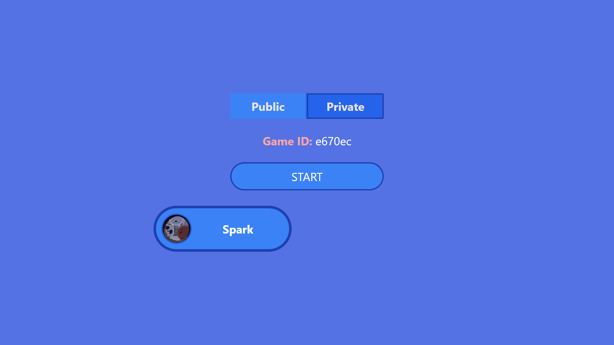
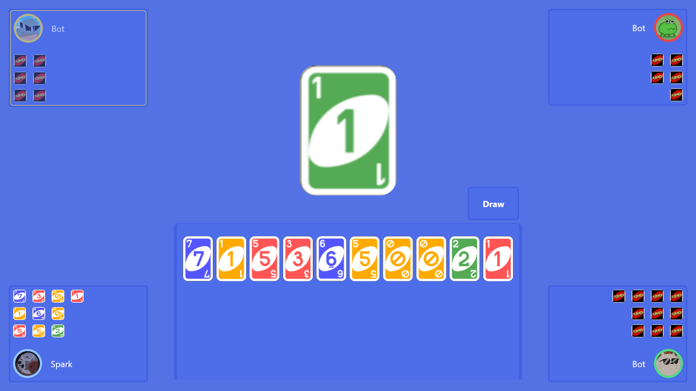

# Uno Game

This is a multiplayer Uno game built using Svelte for the frontend and FastAPI for the backend. The game allows players to compete against each other or play with bots in real time. It follows standard Uno rules and offers real-time interactions using WebSockets.

## Features

- **Multiplayer Mode**: Play Uno with friends or other players online.
- **Bot Mode**: Play against intelligent bots that follow the game rules and simulate real players.
- **Real-time Gameplay**: Smooth real-time interactions using WebSockets for dynamic card play.
- **Game Logic**: The backend handles game rules, including special cards (Skip, Reverse, Draw Two, Wild).
- **FastAPI Backend**: A lightweight and fast backend that manages the game state and WebSocket connections.

